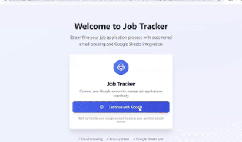

# Automated Job Tracker

Do you apply to hundreds of jobs then often forget to track their statuses since there are too much? Yeah, same here. So I created an app that can automatically read you email and update the job application status to Google sheet. This saved me so much time and I hope it would do the same for you.



## Features

- Fetch unread recruiter emails from Gmail
- Extract job application data (job title, company name, application status) from emails
- Store and manage job application data in a PostgreSQL database
- View and edit job application data through a REST API
- Clear email records from the database
- Integrate with Google Sheets for job data storage
- OpenAI API integration for advanced processing

## Usage

Here is a step by step tutorial on how to use the app.
1. Login with your Google account
    - If you see the screen this app is not secured, I haven't done verifying it with Google yet (sorry it takes 4 - 6 weeks). I would try to complete this ASAP.

2. Connect the desired Google sheet.
    - Create a Google sheet to track your job. Put the link to the sheet in the Google sheet tab and hit "Connect".

3. (First time user only) If you are first time user, the app will ask you to put a time from which you want it to read the email.

4. Hit fetch job.
    - After the first time user set up, the next time you hit "Fetch Job", it would automatically handles emails based on your last time using the app.

5. Open the Google sheet and you will see the jobs automatically added.

## Architecture

This application is built using Django REST Framework with Celery for asynchronous task processing. It integrates with Gmail API to fetch emails, OpenAI API to extract job application data, and Google Sheets API to store the data.

### Technology Stack

- **Backend**: Django 5.1.6, Django REST Framework 3.15.2
- **Authentication**: JWT (djangorestframework-simplejwt), Google OAuth 2.0
- **Task Queue**: Celery 5.5.2 with Redis
- **Database**: PostgreSQL (production), SQLite (mock mode)
- **External APIs**: Gmail API, Google Sheets API, OpenAI API (GPT-4o-mini)
- **Deployment**: Gunicorn, WhiteNoise for static files

## File Structure

```
automated-job-tracker/
├── jobtracker_backend_api/          # Main Django project directory
│   ├── service_provider/            # Main Django app
│   │   ├── migrations/              # Database migrations
│   │   ├── tests/                   # Test files
│   │   │   ├── test_email_services.py
│   │   │   └── test_env.py
│   │   ├── __init__.py
│   │   ├── admin.py                 # Django admin configuration
│   │   ├── apps.py                  # App configuration
│   │   ├── auth.py                  # Custom JWT authentication from cookies
│   │   ├── authenticate.py          # Google API service initialization
│   │   ├── email_services.py        # Gmail API integration and email processing
│   │   ├── googlesheet_services.py  # Google Sheets API integration
│   │   ├── models.py                # Database models (User, JobApplied, FetchLog, GoogleSheet)
│   │   ├── parsers.py               # OpenAI/Ollama extractors for email parsing
│   │   ├── serializers.py           # DRF serializers
│   │   ├── tasks.py                 # Celery tasks
│   │   └── views.py                 # API endpoints
│   ├── __init__.py
│   ├── asgi.py                      # ASGI configuration
│   ├── celery.py                    # Celery configuration
│   ├── settings.py                  # Django settings (production)
│   ├── test_settings.py             # Django settings (testing)
│   ├── urls.py                      # URL routing
│   └── wsgi.py                      # WSGI configuration
├── notebooks/                       # Jupyter notebooks (if any)
├── public/                          # Public assets
│   └── demo.gif
├── staticfiles/                     # Collected static files
├── docker-compose.mock.yml          # Docker compose for mock/testing
├── manage.py                        # Django management script
├── Makefile                         # Make commands
├── Procfile                         # Heroku/deployment configuration
├── pyproject.toml                   # Python project configuration
├── requirements.txt                 # Python dependencies
├── CODE_OF_CONDUCT.md              # Code of conduct
├── CONTRIBUTING.md                  # Contribution guidelines
├── LICENSE                          # MIT License
└── README.md                        # This file
```

### Key Components

#### Models (`models.py`)
- **User**: Custom user model with Google OAuth tokens and sheet ID
- **JobApplied**: Stores job application data (title, company, status, sender email)
- **FetchLog**: Tracks when emails were last fetched for each user
- **GoogleSheet**: Stores Google Sheet IDs (currently not actively used)

#### Services
- **email_services.py**: Handles Gmail API integration, email fetching, parsing, and classification
- **googlesheet_services.py**: Manages Google Sheets operations (reading, writing job data)
- **authenticate.py**: Initializes and manages Google API service clients
- **parsers.py**: Uses OpenAI API to extract structured job data from email content

#### Tasks (`tasks.py`)
- **fetch_emails_task**: Celery task that asynchronously processes emails in the background

## API Endpoints

### Authentication Endpoints

#### `GET /auth/google/login/`
Initiates Google OAuth 2.0 login flow.

**Query Parameters:**
- `redirect_uri` (optional): Frontend URL to redirect after authentication

**Response:** Redirects to Google OAuth consent screen

---

#### `GET /auth/google/callback/`
Handles Google OAuth callback and creates/updates user session.

**Query Parameters:**
- `code`: Authorization code from Google
- `state`: State parameter containing redirect URI

**Response:** Sets JWT access token in HTTP-only cookie and redirects to frontend

---

### User Endpoints

Base URL: `/users/`

#### `GET /users/`
Get current authenticated user information.

**Authentication:** Required (JWT)

**Response:**
```json
{
  "email": "user@example.com",
  "first_time_user": false,
  "sheet_id": "1abc123..."
}
```

---

#### `POST /users/update_user_sheet_id/`
Connect a Google Sheet to the user's account.

**Authentication:** Required (JWT)

**Request Body:**
```json
{
  "google_sheet_url": "https://docs.google.com/spreadsheets/d/1abc123..."
}
```

**Response:**
```json
{
  "status": "updated",
  "google_sheet_id": "1abc123..."
}
```

---

#### `POST /users/remove_sheet_id/`
Disconnect the Google Sheet from the user's account.

**Authentication:** Required (JWT)

**Response:**
```json
{
  "status": "removed",
  "google_sheet_id": null
}
```

---

### Job Application Endpoints

Base URL: `/jobs/`

#### `GET /jobs/`
List all job applications for the authenticated user (paginated).

**Authentication:** Required (JWT)

**Query Parameters:**
- `page` (optional): Page number (default: 1)
- `page_size` (optional): Results per page (default: 10)

**Response:**
```json
{
  "count": 45,
  "next": "http://api.example.com/jobs/?page=2",
  "previous": null,
  "results": [
    {
      "id": 1,
      "job_title": "Software Engineer",
      "company": "Tech Corp",
      "status": "interview",
      "sender_email": "recruiter@techcorp.com",
      "row_number": 1
    }
  ]
}
```

---

#### `GET /jobs/{id}/`
Retrieve a specific job application.

**Authentication:** Required (JWT)

**Response:**
```json
{
  "id": 1,
  "job_title": "Software Engineer",
  "company": "Tech Corp",
  "status": "interview",
  "sender_email": "recruiter@techcorp.com",
  "row_number": 1
}
```

---

#### `PUT /jobs/{id}/`
Update a job application.

**Authentication:** Required (JWT)

**Request Body:**
```json
{
  "job_title": "Senior Software Engineer",
  "company": "Tech Corp",
  "status": "offer"
}
```

---

#### `DELETE /jobs/{id}/`
Delete a job application.

**Authentication:** Required (JWT)

**Response:** 204 No Content

---

#### `POST /jobs/fetch_emails/`
Trigger email fetching and processing (asynchronous).

**Authentication:** Required (JWT)

**Response:**
```json
{
  "task_id": "abc-123-def-456"
}
```

---

### Fetch Log Endpoints

Base URL: `/fetch_logs/`

#### `GET /fetch_logs/`
List fetch history for the authenticated user.

**Authentication:** Required (JWT)

**Response:**
```json
{
  "count": 5,
  "results": [
    {
      "id": 1,
      "last_fetch_date": "2025-10-14T12:34:56Z",
      "user": 1
    }
  ]
}
```

---

#### `POST /fetch_logs/add_log/`
Manually add a fetch log entry (used for first-time user setup).

**Authentication:** Required (JWT)

**Request Body:**
```json
{
  "last_fetch_date": "2025-10-01T00:00:00Z"
}
```

**Response:**
```json
{
  "status": "fetch log added",
  "id": 1
}
```

---

### Task Status Endpoint

#### `GET /task_status/{task_id}/`
Check the status of a Celery task.

**Response:**
```json
{
  "status": "SUCCESS"
}
```

**Possible statuses:** `PENDING`, `STARTED`, `SUCCESS`, `FAILURE`, `RETRY`

---

## How Everything Works Together

### 1. User Authentication Flow

```
User → Frontend → /auth/google/login/
                ↓
            Google OAuth
                ↓
            /auth/google/callback/
                ↓
    JWT Token Set in Cookie → Frontend
```

1. User clicks "Login with Google" on frontend
2. Frontend redirects to `/auth/google/login/` with callback URL
3. Backend redirects to Google OAuth consent screen
4. User grants permissions (Gmail, Google Sheets access)
5. Google redirects to `/auth/google/callback/` with authorization code
6. Backend exchanges code for access/refresh tokens
7. Backend creates/updates User in database with tokens
8. Backend generates JWT and sets it as HTTP-only cookie
9. User is redirected to frontend, now authenticated

### 2. Email Fetching and Processing Flow

```
User → POST /jobs/fetch_emails/
         ↓
    Celery Task Queue
         ↓
    fetch_emails_task
         ↓
    Gmail API → Fetch Emails
         ↓
    OpenAI API → Extract Data
         ↓
    Database → Save JobApplied
         ↓
    Google Sheets API → Update Sheet
         ↓
    Create FetchLog
```

**Detailed Steps:**

1. **User Initiates Fetch**: User clicks "Fetch Jobs" button
2. **API Call**: Frontend sends POST to `/jobs/fetch_emails/`
3. **Task Creation**: Backend creates Celery task and returns task ID
4. **Asynchronous Processing**:
   - Celery worker picks up `fetch_emails_task`
   - Retrieves user's Google access/refresh tokens
   - Initializes Gmail service client
   - Queries Gmail for emails after last fetch date
   - Processes emails in batches (default: 10)
   
5. **Email Processing** (for each email):
   - Fetch raw email content
   - Extract subject and body (HTML → text)
   - Send to OpenAI API with structured prompt
   - OpenAI returns JSON: `{is_job_application_email, job_title, company_name, status}`
   - If job application email: Create/update `JobApplied` record
   
6. **Google Sheets Update**:
   - After each batch, collect all new jobs
   - Use Google Sheets API to update user's sheet
   - Each job gets a row number
   - Writes: Job Title, Company, Status
   
7. **Completion**:
   - Create `FetchLog` entry with current timestamp
   - Frontend polls `/task_status/{task_id}/` to check completion

### 3. Data Flow Diagram

```
┌─────────────┐
│   Frontend  │
└──────┬──────┘
       │ JWT Cookie
       ↓
┌─────────────────────────────────────────────┐
│          Django REST API                    │
│  ┌────────────┐  ┌──────────────┐          │
│  │   Views    │←→│ Serializers  │          │
│  └─────┬──────┘  └──────────────┘          │
│        ↓                                     │
│  ┌────────────┐  ┌──────────────┐          │
│  │   Models   │←→│   Database   │          │
│  └────────────┘  │  (PostgreSQL)│          │
│                  └──────────────┘          │
└─────────────┬───────────────────────────────┘
              │
              ↓
┌─────────────────────────────────────────────┐
│           Celery Worker                     │
│  ┌──────────────────────────────────┐      │
│  │    fetch_emails_task             │      │
│  │                                   │      │
│  │  ┌────────────────────────────┐  │      │
│  │  │   email_services.py        │  │      │
│  │  └────────┬──────────┬────────┘  │      │
│  └───────────┼──────────┼───────────┘      │
└──────────────┼──────────┼──────────────────┘
               │          │
       ┌───────┘          └────────┐
       ↓                           ↓
┌─────────────┐          ┌──────────────────┐
│  Gmail API  │          │ Google Sheets API│
└─────────────┘          └──────────────────┘
       │
       ↓
┌─────────────┐
│ OpenAI API  │
│ (GPT-4o-mini)│
└─────────────┘
```

### 4. Key Design Decisions

- **JWT in HTTP-only cookies**: Prevents XSS attacks while maintaining stateless authentication
- **Celery for async tasks**: Email fetching can take minutes; async prevents timeout
- **Batch processing**: Handles large email volumes efficiently with pagination
- **Token refresh**: Stores both access and refresh tokens for long-term Gmail access
- **Mock mode**: Allows local development without external services using SQLite
- **OpenAI integration**: Robust email parsing without complex regex/NLP logic

### 5. Environment Variables

The application requires these environment variables (see `.env` file):

- `SECRET_KEY`: Django secret key
- `GOOGLE_API_CLIENT_ID`: Google OAuth client ID
- `GOOGLE_API_CLIENT_SECRET`: Google OAuth client secret
- `GOOGLE_API_TOKEN_URI`: Google token endpoint
- `GOOGLE_API_REDIRECT_URI`: OAuth callback URL
- `GOOGLE_API_SCOPE`: Required scopes (Gmail, Sheets)
- `OPENAI_API_KEY`: OpenAI API key
- `CELERY_BROKER_URL`: Redis URL for Celery
- `CELERY_RESULT_BACKEND`: Redis URL for results
- `DB_ENGINE`, `DB_NAME`, `DB_USER`, `DB_PASSWORD`, `DB_HOST`, `DB_PORT`: Database configuration
- `ALLOWED_HOSTS`: Allowed hostnames
- `CORS_ALLOWED_ORIGINS`: Frontend URLs for CORS
- `FRONTEND_REDIRECT_URL`: Frontend URL after OAuth

## Upcoming features

- [ ] Replace OpenAI API with self-hosted model for better clarity
- [ ] Feature: Allow user to choose a timeframe to handle email
- [ ] Email and in-app notifications for status updates
- [ ] Tagging and categorization of job applications  

## Contributing

Contributions are welcome! Please refer to [CONTRIBUTING.md](CONTRIBUTING.md) for more details.

## License

This project is licensed under the MIT License. See the LICENSE file for more details.
